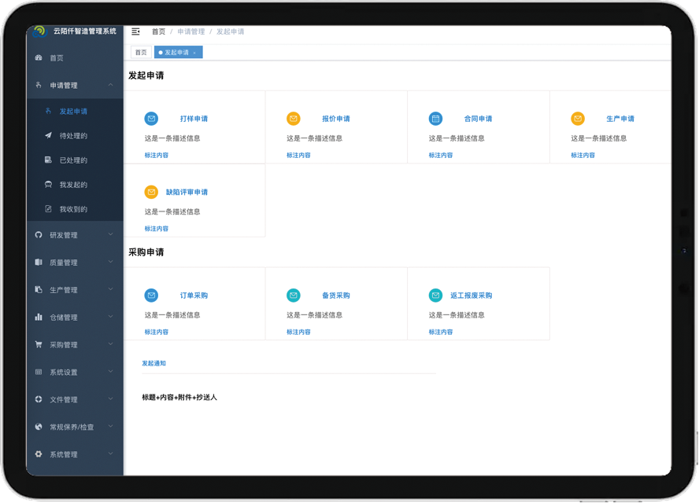

### MES制造执行系统<工厂管理系统>

一.介绍
- MES制造执行系统，适用于工厂管理流程，一款基于java和Vue2的MES系统。
- 支持数据大屏展示，Excel模版导入导出，标签打印，纸张打印等功能。
- 演示地址：http://1.117.176.37/index

二.软件架构
- 软件架构框架
- 开发环境：idea+ MySQL + git +redis
- 软件架构：Spring Boot + Mybatis + MybatisPlus+ SpringDataJpa + Redis+ WkHtmlToPdf + Freemarker + SpringQuartz + Security +(前端)Vue2 + ElementUi

三.功能模块
1. 制造可视化平数据大屏【审批数据，地区销售榜单，产品销售渠道分析，任务完成排行榜，本月销售订单统计图，本月销售订单统计图，订单以及满意度统计图，累计任务次数统计图】
2. 流程审批【打样，报价，合同，生产，缺陷评审，采购订单，备货采购，返工报废采购的申请处理以及审批流程】
3. 研发管理【任务分配，部门任务，班组任务，个人任务，配方创新，配方升级<一期配方，检验报告，一期审核>，创新审核，配方bom<二期配方，成品bom，配方导入>，备案报告，研发统计<配方统计，研发配方>，研发文件】
4. 质量管理【检验管理<检验任务，微生物检验，理化检验，首检，稳定性检验>，巡检管理，审核管理，评审管理，记录查询<巡检记录，质检记录>，文件管理<巡检模板，质检模板，质检记录，文件清单>，成品放行<COA生成，放行>，一键溯源<成品溯源，原料溯源>】
5. 生产管理【任务分配<内料生产，半成品生产，生产任务排产>，班组任务<内料生产，半成品生产>，生产领料<出库指示，分拣任务，称重任务，分拣移库，仓库出库，出库领料，车间领料>，生产学习<指导书学习，指导书审核>，开线清线<检查信息，检查审核，清线信息，清线审核>，生产报产，装箱管理，班组管理，缺料补料，缺料补料审核，生产记录<工艺参数记录，投料记录，生产记录，生产测试记录>】
6. 仓储管理【采购入库，内料入库，半成品入库，成品入库，退料退货入库<收货单做成，物料清点，绑定入库，物料入库，入库称重>，销售出库，补料出库，其他出入库<出库指示，一次分拣，仓库出库，出库确认，销售移库，分拣任务>，盘点指示审核和记录，入库记录，出库记录，称重记录，临期管理，库存管理，托盘信息】
7. 系统设置【设备设置<设备信息，设备保养，设备工艺，设备端口连接日志，设备端口信息，流水线信息，设备类型，开线设置，清线设置>，单位转换，车间管理，厂商管理<生产商管理，生产商品牌，供货商管理，供货商品牌>，仓库管理<仓库管理，库区管理，库位管理>，客户管理<国内客户，国外客户>，物料管理<美国CIR审查安全使用的原料，安全性风险物质危害识别，原料管理，包材管理，预混料管理，成品管理，内料管理，半成品管理，半成品管理，耗材管理，备用原料>，生产配置<生产流程，流程节点，流程配置，节点所属>，审批管理<审批人员，流程名称，流程节点，流程配置，流程记录>，部门管理，岗位管理】
8. 采购管理【采购订单，采购价格】
9. 文件管理【文件清单，记录清单】
10. 常规保养/检查【设备，水】
11. 系统管理【用户管理，员工管理，角色管理，菜单管理，字典管理，参数设置，编码规则，通知公告，日志管理】
12. 开发管理【表单构建，代码生成，系统接口】

四.使用说明
- 免费版只提供基础板块，后续不会进行代码更新迭代
- 商业版系统内容覆盖全面，代码定期实时更新，安装部署一步到位，上手简单，更改容易。配置了代码生成器，减少不必要的重复工作，实现快速开发，上手简单，可以专注于软件逻辑的开发和编写。商业版提供所有模块代码，可以进行模板打印，拥有pc端<java1.8+vue2>，移动端<物流PDA扫码枪端(Android+java1.8)>。定制版本，可以进行模板打印，拥有pc端<java1.8+vue2>，移动端<物流PDA扫码枪端(Android+java1.8)>。
- 定制版系统，根据工厂的实际需求来进行量身定制，切实满足工厂和企业的实际应用，提高工厂的执行效率，甲方只需要提供需求，我们这边安排技术定制开发。
- 采用了前后端分离的技术，达到实现前后端解耦，增加代码的维护性和易读性，开发效率和定位问题的效率提高。
- 数据库表设计采用一对多的关联映射，便于管理、可提高一定的查询速度，减轻 CPU 的 IO 读写，提高存取效率。

五.联系我们
- 商业版请联系微信：18272221065
- 官网地址：http://www.ymqjn.com/mes/index.html
- 商业版演示地址：http://1.117.176.37/index
- 帐号：admin密码：admin123
- 

六.图片展示<部分图片>

